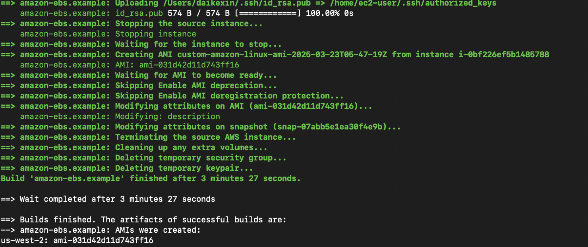
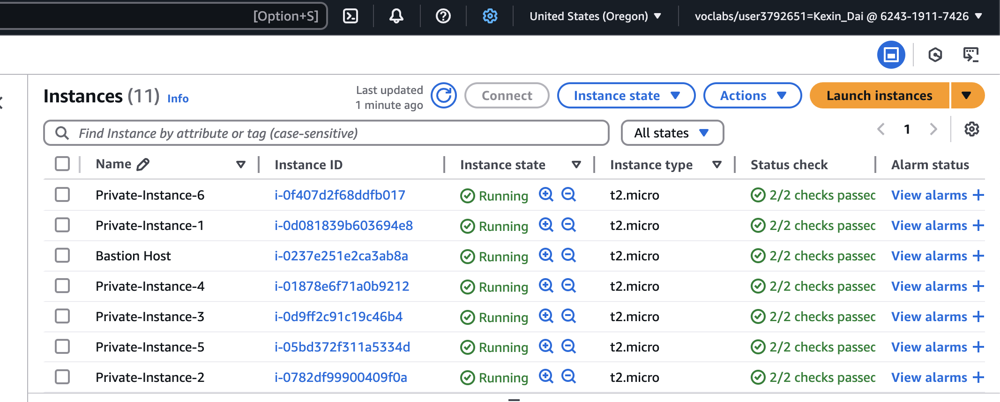
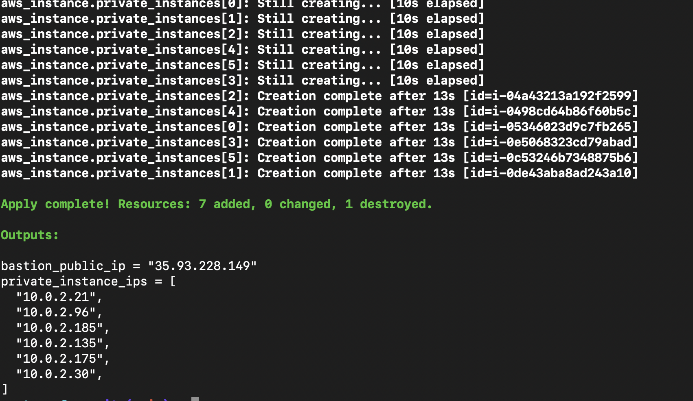
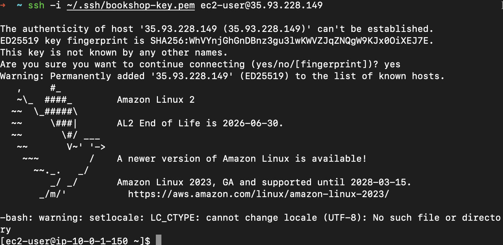
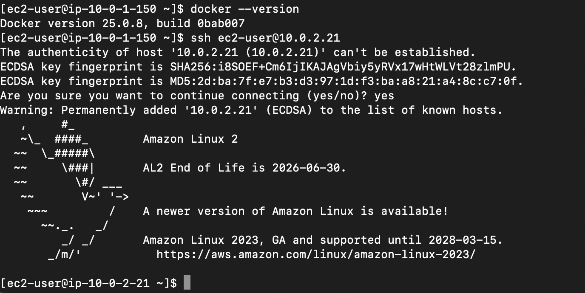

# AWS Infrastructure Automation with Packer and Terraform

This project automates the creation and deployment of infrastructure on AWS using **Packer** and **Terraform**. It covers the following tasks:

## Project Requirements

### A. Custom AWS AMI creation using Packer
- **Base AMI**: Amazon Linux 2
- **Installed Software**: Docker
- **SSH Access**: Configured with your SSH public key for authentication

### B. Terraform scripts provisioning AWS resources
- **VPC** with proper CIDR configuration
- **Public and Private Subnets** with appropriate route tables
- **Bastion Host** in the public subnet with SSH (port 22) access limited to your IP
- **6 EC2 instances** in a private subnet, based on the custom AMI created by Packer

## Repository Structure

```bash
project-root/
├── packer
│   └── amazon-linux.pkr.hcl
└── terraform
    ├── provider.tf
    ├── vpc.tf
    ├── security_groups.tf
    ├── ec2.tf
    ├── data_sources.tf
    └── outputs.tf
```

## How to Run

### Step 1: Create Custom AMI using Packer

Navigate to the `packer` directory:

```bash
cd packer
packer init .
packer build amazon-linux.pkr.hcl
```

Note the resulting AMI ID from the output.

### Step 2: Deploy Infrastructure using Terraform

Navigate to the `terraform` directory:

```bash
cd ../terraform
terraform init
terraform validate
terraform plan
terraform apply
```

Terraform will automatically select your most recent AMI created by Packer based on name filtering.

## Expected Outputs

Upon successful completion, Terraform outputs:

- Public IP of the **Bastion Host**.
- Private IP addresses of the **6 EC2 instances**.

Example:

```bash
bastion_public_ip = "35.93.228.149"

private_instance_ips = [
  "10.0.2.5",
  "10.0.2.6",
  "10.0.2.7",
  "10.0.2.8",
  "10.0.2.9",
  "10.0.2.10",
]
```

## Connecting to Instances

### SSH into Bastion Host

```bash
ssh -i ~/.ssh/your-key.pem ec2-user@<bastion_public_ip>
```

### SSH into Private Instances via Bastion Host

Use SSH Agent Forwarding:

```bash
ssh -A -i ~/.ssh/your-key.pem ec2-user@<bastion_public_ip>
```

Then from the Bastion Host:

```bash
ssh ec2-user@<private_instance_ip>
```

## Screenshots

To demonstrate completion of the assignment, include the following screenshots:

1. Packer AMI creation success log.


2. AWS Console showing the custom AMI.

3. Terraform successful apply output.

4. AWS Console showing all EC2 instances (bastion and private instances).

5. Successful SSH login to the Bastion Host.

6. Successful SSH login to private instance from Bastion Host.



