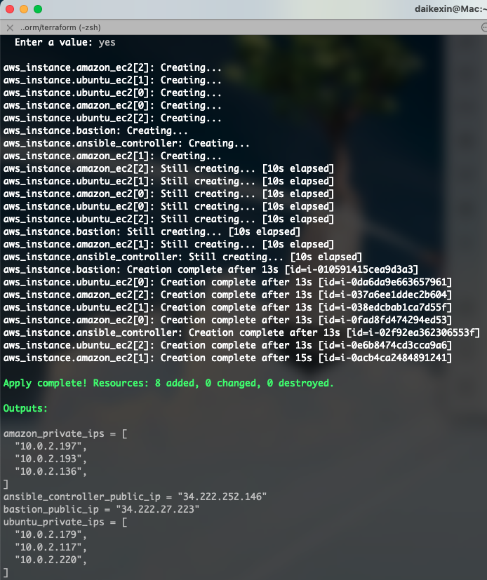
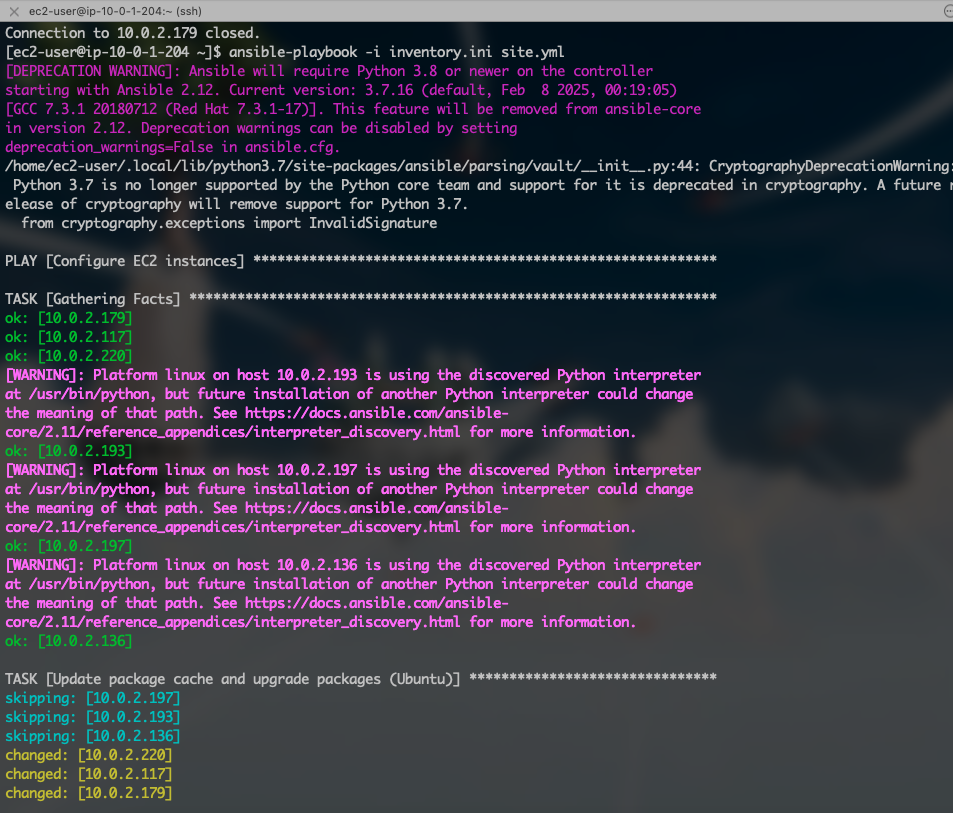

# Assignment #10 - Multi-OS EC2 Configuration with Ansible

## Requirement
Requirements: (use the same terraform repo and create a new assignment10 branch)

Update your previous Terraform assignment to provision 6 EC2: 3 Ubuntu and 3 Amazon Linux. Tag them with (OS: ubuntu or OS:amazon). 1 more EC2 instance to host the Ansible Controller
Create an Ansible Playbook for the 6 EC2 instance
Target the 6 ec2 instances and perform the following:
Update and upgrade the packages (if needed)
Verify we are running the latest docker
Report the disk usage for each ec2 instance
Update your repo with a new branch and update the README file for me to follow the instructions so I can run the terraform provisioning and the ansible playbook.

## Overview
This project provisions a multi-OS EC2 environment using Terraform and configures the instances using Ansible. It includes:

- A VPC with public and private subnets
- NAT Gateway to allow private instances to access the internet
- 3 Ubuntu EC2 instances (in private subnet)
- 3 Amazon Linux EC2 instances (in private subnet)
- 1 Ansible Controller EC2 instance (in public subnet)
- Ansible Playbook to:
  - Update/upgrade packages
  - Ensure latest Docker is installed
  - Print disk usage

---

## Repo Structure
```
.
├── ansible
│   ├── inventory.ini
│   └── site.yml
├── images
│   └── (place screenshots here)
├── packer
│   └── amazon-linux.pkr.hcl
├── terraform
│   ├── data_sources.tf
│   ├── ec2.tf
│   ├── outputs.tf
│   ├── provider.tf
│   ├── security_groups.tf
│   ├── vpc.tf
│   └── terraform.tfstate / .backup
└── README.md
```

---

## Prerequisites
- AWS CLI configured
- Terraform installed
- Ansible installed (on Ansible Controller EC2)
- A valid AWS key pair (`bookshop-key.pem`)

---

## Instructions

###  Step 1: Build AMI with Packer
```bash
cd packer
packer init .
packer validate amazon-linux.pkr.hcl
packer build amazon-linux.pkr.hcl
```

### Step 2: Provision Infrastructure with Terraform
```bash
cd terraform
terraform init
terraform plan
terraform apply
```

###  Step 3: SSH to Ansible Controller
```bash
ssh -i ~/.ssh/bookshop-key.pem ec2-user@<ansible_controller_public_ip>
```

###  Step 4: Install Ansible on Controller
```bash
sudo yum update -y
sudo yum install -y python3 pip
pip3 install --user ansible
export PATH=$PATH:~/.local/bin
ansible --version
```

### 📁 Step 5: Upload Files to Ansible Controller
```bash
scp -i ~/.ssh/bookshop-key.pem /path/to/inventory.ini ec2-user@<controller-ip>:~/inventory.ini
scp -i ~/.ssh/bookshop-key.pem /path/to/site.yml ec2-user@<controller-ip>:~/site.yml
scp -i ~/.ssh/bookshop-key.pem ~/.ssh/bookshop-key.pem ec2-user@<controller-ip>:~/bookshop-key.pem
```

### 🛠 Step 6: Run Playbook
```bash
ansible -i inventory.ini all -m ping
ansible-playbook -i inventory.ini site.yml
```

---

## Expected Output

### ✅ Docker Versions
Ubuntu:
```
ok: [10.0.2.220] => {
    "docker_version_output.stdout": "Docker version 26.1.3, build 26.1.3-0ubuntu1~20.04.1"
}
```
Amazon Linux:
```
ok: [10.0.2.136] => {
    "docker_version_output.stdout": "Docker version 25.0.8, build 0bab007"
}
```

### ✅ Disk Usage Output
```
ok: [10.0.2.220] => {
    "disk_usage_output.stdout": "Filesystem      Size  Used Avail Use% Mounted on\n/dev/root       7.6G  2.6G  5.0G  35% /\ndevtmpfs        469M     0  469M   0% /dev\ntmpfs           478M     0  478M   0% /dev/shm\ntmpfs            96M  908K   95M   1% /run\ntmpfs           5.0M     0  5.0M   0% /run/lock\ntmpfs           478M     0  478M   0% /sys/fs/cgroup\n/dev/loop0       27M   27M     0 100% /snap/amazon-ssm-agent/9881\n/dev/loop1       64M   64M     0 100% /snap/core20/2496\n/dev/loop2       45M   45M     0 100% /snap/snapd/23771\n/dev/loop3       92M   92M     0 100% /snap/lxd/32662\n/dev/loop4       74M   74M     0 100% /snap/core22/1748\n/dev/xvda15     105M  6.1M   99M   6% /boot/efi\ntmpfs            96M     0   96M   0% /run/user/1000"
}
```

---

## Screenshots

### instances


### ips


### ping test


### res



---

## Notes
- Use `ec2-user` for Amazon Linux, `ubuntu` for Ubuntu in `inventory.ini`
- Ensure SSH private key (`bookshop-key.pem`) has permission `chmod 400`
- Ubuntu apt update need NAT gateway to visit Internet

---

## Clean Up
```bash
terraform destroy
```
